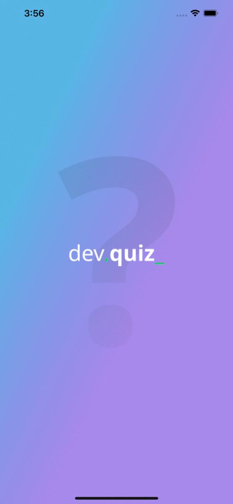

<p align="center">
    
</p>

## DevQuiz

- ✅ Liftoff 💪
- ✅ Maximum Speed 🏃‍♂️
- ✅ In Orbit 👨‍🚀
- ✅ Landing ⚡
- ✅ Surface Exploration  🚀

---

## Preview 📱



---

## Layout 🎨

The Layout was developed by [Tiago Luchtenberg](https://instagram.com/tiagoluchtenberg), and you can access it on Figma: [Layout](./DevQuiz.fig)

---

## How to Use Flutter 🤔
- First of all, correctly configure the Flutter development environment on your machine, see https://flutter.dev/docs/get-started/install

```bash
- Clone this repository:
$ git clone https://github.com/paulorcvieira/dev-quiz-flutter

- Enter in directory:
$ cd dev-quiz-flutter

- For install dependencies:
$ flutter pub get

- Run the app:
$ flutter run
```

---

## How to Contribute 💪

- Fork the project

```bash
- Create a new branch with your changes:
$ git checkout -b my-feature

- Save your changes and create a commit message telling you what you did:
$ git commit -m "feat: my new feature"

- Submit your changes:
$ git push origin my-feature
```

---

## License 📝

This repository is under MIT license. You can see the [LICENSE](https://github.com/paulorcvieira/dev-quiz-flutter/blob/master/LICENSE) file for more details. 😉

  ---

  > If it helped you, give ⭐ **contribute**, it will help me too 😉

---

  <div align="center">

  [](https://www.linkedin.com/in/paulorcvieira/)

  </div>